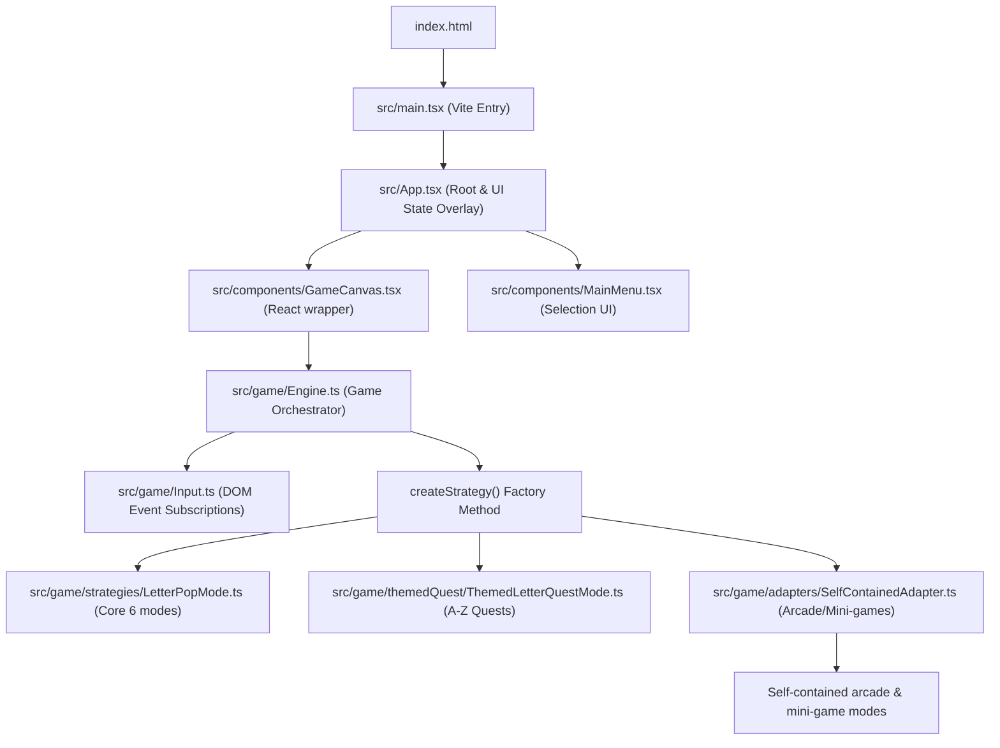
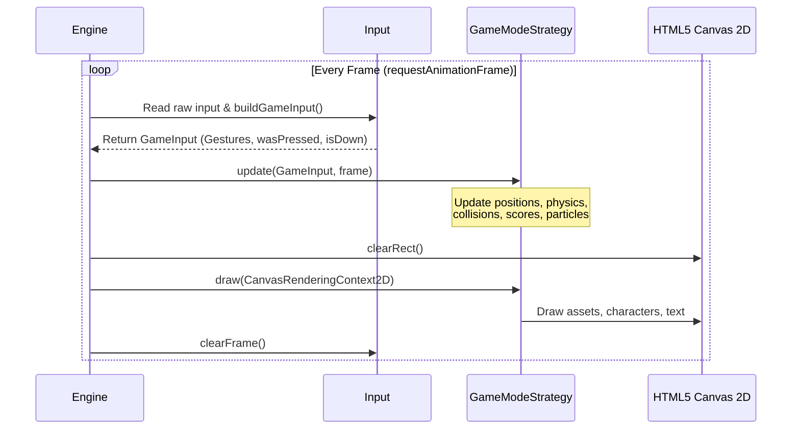

# ABC World Repository Architecture

This document describes the design patterns, code structure, data flow, and runtime mechanics of **ABC World**—an educational alphabet game for children ages 4+ featuring character designs based on the *Alphabet Lore*, *Zombie Alphabet*, and *OddBods* IPs.

---

## 1. System Topology & Lifecycle

The project is structured to run as a single-page React application for the web (bootstrapped using **Vite + React 19**) while sharing its core TypeScript physics, state, and game logic with mobile builds (planned for **React Native + Shopify Skia**).

### Bootstrapping Flow

The following diagram illustrates how the system starts up and connects the React-based shell/UI overlays to the canvas-based game loop:



### Components Lifecycle & Responsibilities

1. **[App.tsx](file:///Users/rony/dev/abcgame/src/App.tsx)**: Manages higher-level screen transitions (`menu` vs. `playing`), global state (current high scores, levels, active configuration), and displays the non-interactive DOM/React overlays (the HUD and game-over overlay buttons).
2. **[GameCanvas.tsx](file:///Users/rony/dev/abcgame/src/components/GameCanvas.tsx)**: Acts as the bridge between React's declarative rendering and the imperative Canvas 2D API. It instantiates the [Engine](file:///Users/rony/dev/abcgame/src/game/Engine.ts), attaches listeners for window resizing, and handles teardown of the animation frame.
3. **[HUD.tsx](file:///Users/rony/dev/abcgame/src/components/HUD.tsx)**: A lightweight, responsive overlay built in React to display lives, scores, ammo counters, and completed letters without impacting the performance of the game's rendering thread.

---

## 2. Core Loop Orchestration

The core loop is managed by the **[Engine](file:///Users/rony/dev/abcgame/src/game/Engine.ts)** class. 

### Game Loop Lifecycle

The engine operates on a traditional loop driven by the browser's `requestAnimationFrame` API. Each frame triggers three distinct stages:



- **Update (`update`)**: Reads physical inputs (via `GameInput`), queries current game rules, and calculates movements, collisions, timers, and animations.
- **Draw (`draw`)**: Clears the canvas buffer and delegates rendering actions to the active mode strategy.
- **Input Reset (`clearFrame`)**: Clears the transient "just pressed" keyboard registers and pointer gestures to prepare for the subsequent frame.

### GameState Synchronization

The engine exposes a `GameState` structure that mirrors essential attributes:
```typescript
interface GameState {
  score: number
  collectedSet: Set<string>
  totalCollected: number
  mode: GameMode
  wordsCompleted: number
  currentWord?: WordEntry
  oddScore: number
  winner: 'human' | 'oddbods' | null
  lives?: number
  timeLeft?: number
  highScore?: number
  ammoLeft?: number
  currentLevel?: number
  totalLevels?: number
  customTitle?: string
}
```
Whenever an active strategy updates this state, a callback (`onStateChange`) fires, prompting the React shell to re-render the HUD or game-over dialogs.

---

## 3. Input Handling & Normalization

To ensure cross-platform portability, ABC World isolates browser-level mouse, touch, and keyboard events from the gameplay logic using the **[Input](file:///Users/rony/dev/abcgame/src/game/Input.ts)** system.

### Input Flow

1. **Raw Event Capturing**: [Input.ts](file:///Users/rony/dev/abcgame/src/game/Input.ts) binds listeners to `window` for DOM input (`keydown`, `keyup`, `click`, `mousedown`, `mousemove`, `mouseup`, `touchstart`, `touchmove`, `touchend`).
2. **Input Compilation**: Once per frame, [Engine.ts](file:///Users/rony/dev/abcgame/src/game/Engine.ts) calls `buildGameInput()`, which translates mouse/touch click points relative to the canvas bounding client rectangle (`DOMRect`).
3. **Gesture Normalization**: Multi-touch and drag coordinates are mapped to a structured `Gesture` list, while keyboard inputs are exposed through single-frame polling methods (`wasPressed` and `isDown`):

```typescript
interface Gesture {
  type: 'tap' | 'drag' | 'swipe' | 'longpress'
  x: number
  y: number
  dx?: number  // delta x
  dy?: number  // delta y
}

interface GameInput {
  gestures: Gesture[]
  wasPressed(key: string): boolean
  isDown(key: string): boolean
  mouseDown: boolean
  mouseX: number
  mouseY: number
  justReleased: boolean
}
```

*Strategies should rely on `gestures` for pointer interactions and query `wasPressed`/`isDown` for key-bound commands.*

---

## 4. The Strategy & Adapter Patterns

The game relies heavily on the **Strategy Pattern** to decouple individual game modes from the orchestrating loop. All mode implementations conform to the **[GameModeStrategy](file:///Users/rony/dev/abcgame/src/game/GameModeStrategy.ts)** interface:

```typescript
export interface GameModeStrategy {
  onStateChange?: (state: any) => void
  start(canvasW: number, canvasH: number): void
  update(input: GameInput, frame: number): void
  draw(ctx: CanvasRenderingContext2D): void
  resize(w: number, h: number): void
  restart(canvasW: number, canvasH: number): void
  destroy(): void
}
```

The game strategies are organized into three primary architectural categories:

### A. Core Shared Loop (backed by [LetterPopCore.ts](file:///Users/rony/dev/abcgame/src/game/strategies/LetterPopCore.ts))
Uses a shared strategy class (`LetterPopCore`) wrapped inside `LetterPopMode` to drive the six original modes:
- **Free Pop**, **Word Pop**, **Survival**, **Time Attack**, **Word Race**, and **Defense**.
- *Mechanics*: Coordinates floating alphabet letters, spawning chasers (OddBods or Zombies), timer countdowns, and life losses.

### B. Themed & Staged A-Z Quests (backed by [ThemedLetterQuestMode.ts](file:///Users/rony/dev/abcgame/src/game/themedQuest/ThemedLetterQuestMode.ts))
An abstract base strategy that powers 11 themed and staged sub-modes (such as *Bakery*, *Mail Carriers*, *Doctor*, *Train*, *Garden*, *Construction*, etc.):
- *Mechanics*: Standardizes A-Z progression. It sets `currentLetter`, generates a pool of 5 floating choices (incorporating correct answers and distractors), triggers particle explosions upon correct choices, and updates progress milestones. Subclasses only implement custom graphics, HUDs, overlays, and transition animations.

### C. Self-Contained Arcade Adapter (backed by [SelfContainedAdapter.ts](file:///Users/rony/dev/abcgame/src/game/adapters/SelfContainedAdapter.ts))
For unique, complex mini-games (e.g. *Odd Birds* physics, *Letter Runner* endless runner, *Evolution Lab* evolutionary upgrades, *Alphabet Arcade* fighter), the adapter bridges their custom APIs (implementing `SelfContainedMode`) into the unified `GameModeStrategy` interface.

---

## 5. Character Representation & Rendering

Characters are represented as Alphabet Lore-themed alphabet letters featuring eyes, eyelids, outlines, and filled bodies.

### Data vs. Presentation Separation

- **Data Definition ([data.ts](file:///Users/rony/dev/abcgame/src/characters/data.ts))**: Holds pure structural information for all 26 letters (`bodyColor`, `outlineColor`, `eyeWhiteColor`, `pupilColor`, `eyelidColor`, and `role`).
- **Canvas Rendering ([draw.ts](file:///Users/rony/dev/abcgame/src/characters/draw.ts))**: Contains rendering procedures that translate a letter def and reference boundaries into bezier curves, outlines, and pupils tracking a target coordinate.

---

## 6. Planned Refactoring: Split Renderer

To support both **Web (Canvas 2D)** and **Mobile (React Native Skia)** without duplicating logic, the system is designed to decouple visual rendering from character state machines and physics.

### Architecture Schema (Target)

```
        +----------------------------------------+
        |                Engine                  |
        +-----------------------+----------------+
                                |
                                v
                   +------------+-----------+
                   |    GameModeStrategy    |
                   +------------+-----------+
                                |
                                v
                       +--------+--------+
                       |    Renderer     |  (Interface)
                       +--------+--------+
                                |
        +-----------------------+-----------------------+
        |                                               |
        v                                               v
+-------+---------------+                       +-------+---------------+
|    Canvas2DRenderer   | (Web)                 |     SkiaRenderer      | (RN Mobile)
+-----------------------+                       +-----------------------+
```

### Transition Steps
1. **Define the Renderer Interface**: Declare abstract methods such as `drawLetter(letter, x, y, options)`, `drawBackground(type)`, `drawChaser(chaser)`, and `drawParticle(p)`.
2. **Migrate Entities**: Refactor components like [draw.ts](file:///Users/rony/dev/abcgame/src/characters/draw.ts), [Background.ts](file:///Users/rony/dev/abcgame/src/game/Background.ts), and [OddbodChaser.ts](file:///Users/rony/dev/abcgame/src/game/OddbodChaser.ts) to delegate their rendering code to the current `Renderer` context rather than calling the Canvas 2D context directly.
3. **Inject Renderer Context**: Instantiated by the platform wrapper (e.g. [GameCanvas.tsx](file:///Users/rony/dev/abcgame/src/components/GameCanvas.tsx) instantiates `Canvas2DRenderer` and passes it to the `Engine`).
